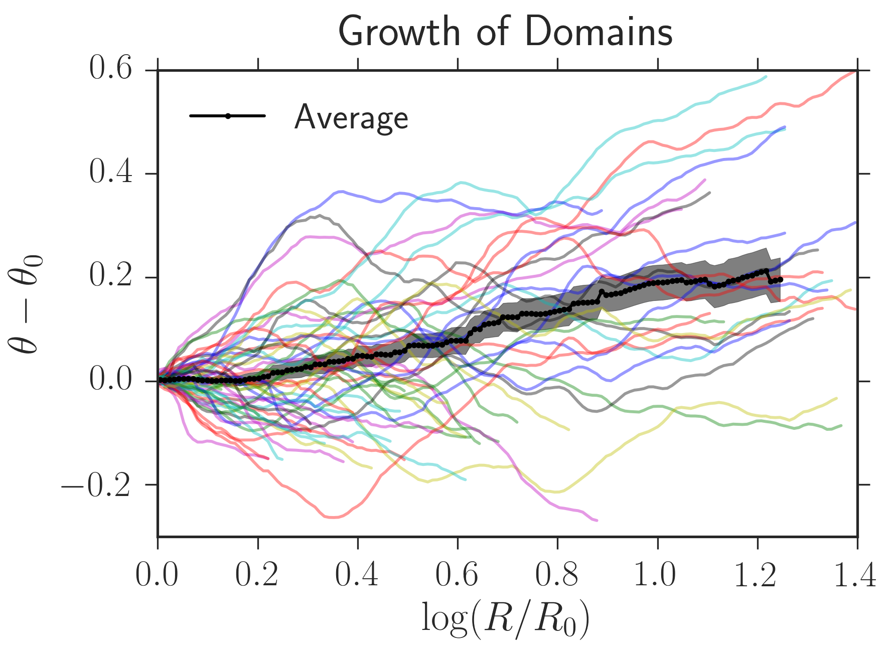

# Range Expansion Image Analysis
 
A set of image analysis tools to analyze range expansions. Requires
ImageJ/Fiji pre-processing routines to be run first.

For usage info, see the *doc* folder.

 

